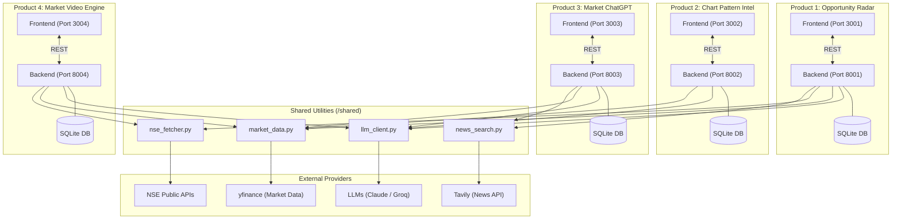

# System Architecture

The repository is structured as a monolithic repository containing 4 independent, highly decoupled AI products. 

Each product operates as a standalone microservice with its own dedicated React frontend and FastAPI backend, communicating only with external services or the `shared` utilities module.

## High-Level Architecture Diagram

## Shared Module (`/shared`)
To prevent code duplication, the 4 products rely on a common utilities package:
- **`llm_client.py`**: A unified wrapper to interact with Claude 3.5 Sonnet and Groq. Handles fallbacks and JSON parsing.
- **`market_data.py`**: Interacts with the `yfinance` library to pull historical OHLCV data.
- **`nse_fetcher.py`**: A specialized client to fetch live data directly from NSE India APIs (e.g. bulk deals, indices).
- **`news_search.py`**: Wraps the Tavily API for semantic news retrieval.

## Design Principles
1. **Decoupled Deployments**: If one teammate's product crashes, the other 3 continue to function flawlessly. They do not share databases or memory states.
2. **Local Priority**: All products use SQLite for fast, localized state management (paper trading ledgers, video history, alert stores) to ensure zero setup friction.
3. **Stateless Operations**: AI inferences and market analyses are stateless and rely entirely on live or cached pulls from `shared`.
